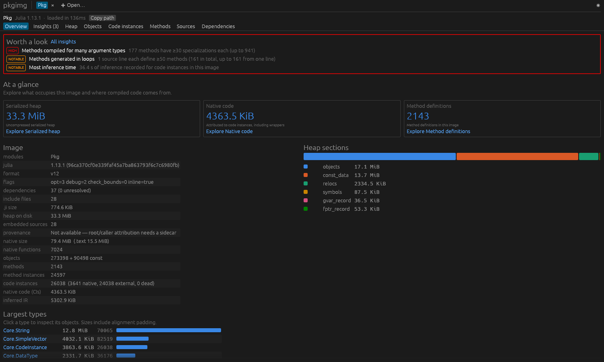
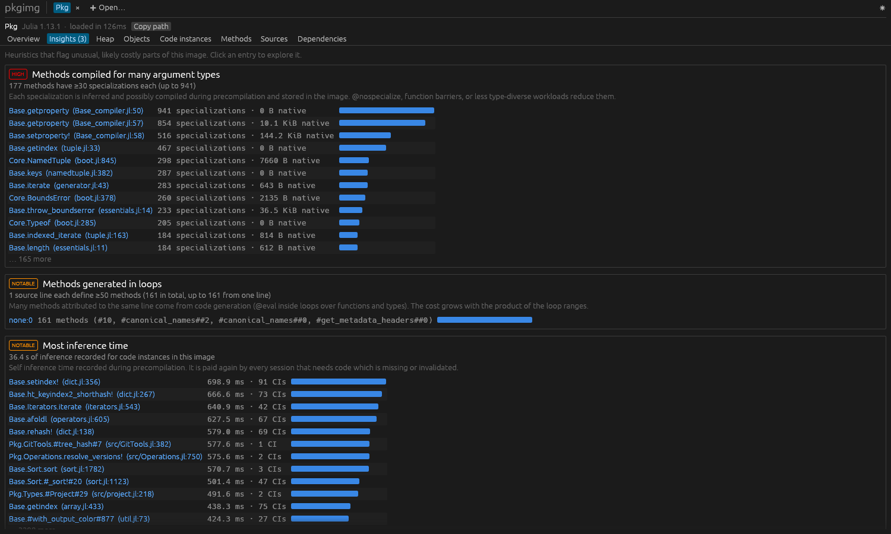
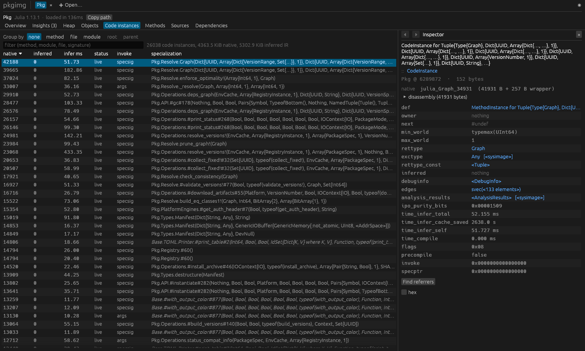
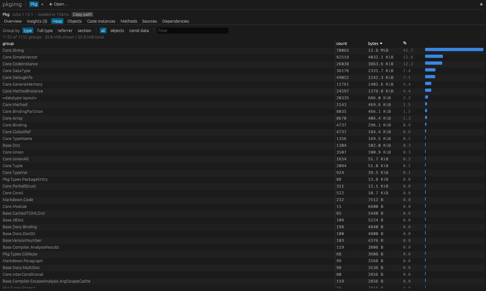

# pkgimg

Fast, standalone inspector for Julia package images (`.ji` + `.so`) and system images.
It reads the files directly, so no Julia process is needed, and it resolves references
into the system image and dependency caches to name every type, method and specialization.

- `pkgimg`: CLI with text or JSON output, for humans, scripts and agents
- `pkgimg-gui`: egui desktop app and browser build

Supported formats: Julia master (image format v16) and 1.13 (v12), 64-bit.

The GUI on the `Pkg` stdlib image from Julia 1.13.1:

| Overview | Insights |
|:-:|:-:|
|  |  |
| **Code instances and inspector** | **Heap histogram** |
|  |  |

## CLI

```
pkgimg summary   <file.ji>                   overview: header, sizes, counts, largest types
pkgimg heap      <file.ji> [--by type|full-type|referrer|section] [--section all|objects|const]
pkgimg compiled  <file.ji> [--by method|file|module|root|parent] [--sort native|inferred|infer-time|name]
                           [--filter STR] [--sig STR] [--external]
pkgimg methods   <file.ji>
pkgimg insights  <file.ji>                   unusual parts: functions with very many methods, @eval
                                             loops, piracy, many specializations, invalidated code,
                                             code a system image keeps for the compiler's world
pkgimg objects   <file.ji> [--type STR] [--sort offset|size]
pkgimg show      <file.ji> <offset> [--const]  decode one object: fields, elements, referrers
pkgimg why       <file.ji> <offset|substring>  inference chain of a code instance (needs provenance)
pkgimg diff      <a.ji> <b.ji>                 before/after: code instances per method, heap per type
pkgimg deps      <file.ji>
pkgimg sources   <file.ji> [--show FILE]       source files embedded in the cache file
```

Global options: `--json`, `-n/--limit N` (0 = all), `--sysimage PATH`, `--depot DIR`,
`--provenance PATH`, `-v`.

The system image is found automatically (next to stdlib caches, via `julia` on `PATH`, the
current directory's `usr/`, or juliaup installs), and checked by matching the `Core` build
id. Set `JULIA_SYSIMAGE` or pass `--sysimage` otherwise. Dependency caches are looked up
in `$JULIA_DEPOT_PATH` / `~/.julia` and the stdlib cache directory by uuid and build id.

### For agents

Every command supports `--json`. Successful JSON responses include `schema: "pkgimg/1"`.
Table responses include `total_rows` and `truncated`; `-n 0` returns all rows. Summary uses
these fields for `top_types`. Diff reports truncation for each of its three tables and
a combined `truncated` flag. Signatures have gensym counters removed in `diff` to make
comparisons more stable across builds.

Check `image.resolution.complete` before relying on decoded names. The same object
includes the resolved system-image path and `missing_dependencies`. Warnings go to
stderr. Ungrouped `compiled` and `methods` rows include `offset` and `const`, which can
be passed to `show` (`--const` when true) or used to select a code instance with `why`.
`sources --show FILE --json` returns source text and its path in a JSON object.
`compiled --filter` matches the qualified method name (`Pkg.Resolve.Graph`), `--sig` the
argument and callee types. When the callee type tells specializations apart (closures with
captured types, `TypeEgal{T}` constructors), rows show `Mod.(::Callee)(args)` and carry it as
`callee`. In a system image, `status` is `compiler-world` for code kept only for the world the
compiler runs in (`summary` gives both worlds). Native sizes count one CPU target; `clone_bytes` and `summary` give the clones
compiled for the other targets of a multiversioned image.
`methods` rows also give the extended function (`func`), whether another module owns it
(`func_external`), possible piracy (`pirate`) and whether it is a keyword method
(`kwcall`, attributed to the function it wraps). `insights --json` returns `insights`,
most severe first, each with a `severity` (`high`, `notable`, `info`), a summary, and
`items` whose `link` names a function, source line, method or object.

A typical loop to reduce compiled code:

1. `pkgimg compiled X.ji --by method --json`: which methods have the most specializations
   and native code
2. `pkgimg compiled X.ji --by root --json`: which entry points (precompile workload calls)
   cause them (needs provenance, see below)
3. change the package, re-precompile, then `pkgimg diff old.ji new.ji --json`

### Provenance (experimental)

An instrumented Julia (branch `kc/image-provenance`) records, for each code instance that
inference publishes during precompilation, the caller whose inference requested it and the
root of that inference. Set `JULIA_IMAGE_PROVENANCE=<dir>` while precompiling. This writes
`<dir>/<Module>-<build_id>.tsv`, which `pkgimg` picks up through `--provenance <dir>` or
the same environment variable.

## GUI

```
cargo run --release -p pkgimg-gui -- path/to/cache.ji
```

Files can also be dropped onto the window. Tabs: overview, insights, heap histogram,
objects, code instances, methods (grouped by function or source line), embedded sources
(with per-line method markers) and dependencies. The inspector decodes any object and
links to its fields across images. Back and forward (⏴/⏵, alt+←/→ or the mouse side
buttons) step through visited views and inspected objects. The overview
cards link to heap, compiled code and methods, and the overview lists anything the
insights flag. Copy path reuses the current image in CLI commands.

Each image opens in its own tab above the views; opening a file that is already open
switches to it. Click a dependency (or "Open" in the inspector) to open that image in a
new tab. Ctrl+O shows the cache browser (Enter opens its first match), Ctrl+W closes a
tab and Ctrl+Tab / Ctrl+PageDown switch tabs.

To build the browser version (requires the `wasm32-unknown-unknown` target and a
`wasm-bindgen` CLI matching the locked dependency):

```
sh crates/pkgimg-gui/build-web.sh
```

Serve `crates/pkgimg-gui/web/` with a static HTTP server. Drop the package `.ji` and
native library together with its system image and dependency files. The browser
selects a package that is not a dependency of another dropped package.

Screenshots of every tab are rendered offscreen with:

```
PKGIMG_SHOT_FILE=x.ji PKGIMG_SHOT_DIR=out cargo test --release -p pkgimg-gui -- --ignored screenshots
```

## How it works

A pkgimage heap is the output of `jl_save_system_image_to_stream` (`src/staticdata.c`). It
is an object section laid out like the live heap, with pointer fields replaced by tagged
relocation words. It is followed by constant data, a symbol table, delta-encoded offset
lists (one type tag per object, plus every pointer slot), and the tables linking code
instances to the native code in the shared library (`fptr_record`, `jl_image_pointers`).
Objects are decoded generically through the type layouts that are themselves serialized
in the images. Only a few C struct offsets (DataType, TypeName, Module) are hard-coded.

## Validation

```
cargo test --workspace
PKGIMG_TEST_IMAGES=/path/to/package.ji cargo test -p pkgimg-core --test smoke
PKGIMG_SWEEP_MAX=25 cargo test -p pkgimg-core --test sweep -- --ignored --nocapture
```

The ordinary tests include synthetic parser, CLI JSON and GUI state regressions.
The smoke test needs a real image and a matching system image; without the environment
variable it skips its checks. The optional sweep samples local caches and accepts
unsupported-format errors, but fails on panics. `PKGIMG_SWEEP_MAXSIZE` limits every
input file, including native libraries (default 30 MiB).
